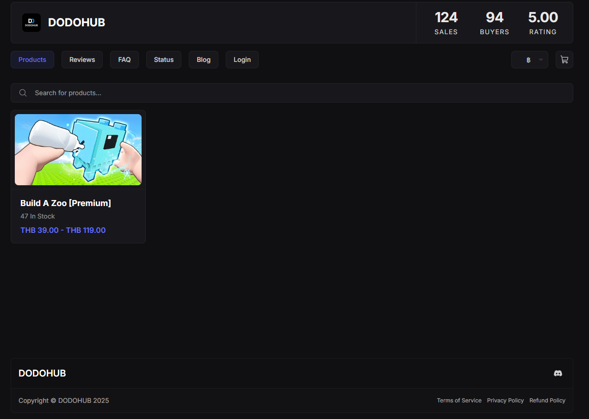

# 🛒 วิธีซื้อสคริปต์



**เข้าสู่เว็บไซต์** [**https://dodohub.mysellauth.com/**](https://dodohub.mysellauth.com/)



**เลือกสินค้าหรือสคริปต์ที่ต้องการซื้**

ตรวจสอบชื่อสินค้า/สคริปต์ให้แน่ใจก่อนทำการเลือก

<figure><figcaption></figcaption></figure>




**เลือกอายุการใช้งานสคริปต์ และทำการกด Buy Now**

<figure><figcaption></figcaption></figure>




* **กรอกอีเมลสำหรับรับสินค้า**&#x20;
* **เลือกช่องทาง Stripe หากไม่มี Litecoin**&#x20;
* **ทำการติ๊ก Terms of Service.**

<figure><figcaption></figcaption></figure>


## Coupon Code เป็นโค้ดส่วนลด หากไม่มีก็ไม่ต้องใส่




**เลือกช่องทางการชำระเงิน**

**Stripe** : รองรับการชำระเงินหลายช่องทาง เช่น ธนาคาร, ทรูมันนี่, QR พร้อมเพย์

<figure><figcaption></figcaption></figure>

**Crypto** : ใช้สำหรับผู้ที่ต้องการชำระด้วยเหรียญดิจิทัล

<figure><figcaption></figcaption></figure>


## หากคุณไม่มีเหรียญ Crypto แนะนำให้เลือกช่องทาง **Stripe** จากนั้นกด “ซื้อ” เพื่อทำรายการ




### หลังจากซื้อสำเร็จ

ให้ Copy Key ตรง Deliverables และ อ่านต่อที่ [premium.md](premium.md "mention")

<figure><figcaption></figcaption></figure>




## กรณีทำคีย์หาย หรือ อยากกลับมาหาคีย์ ให้ไปเช็คในอีเมลที่ใส่ไปตอนกรอก

